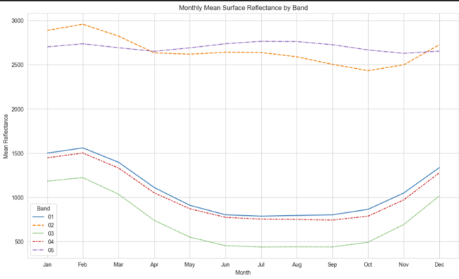
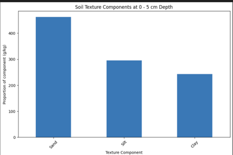
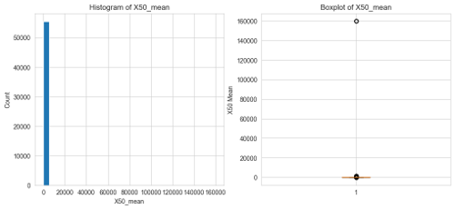
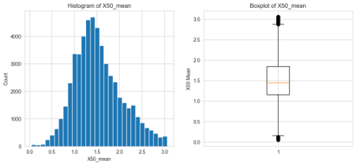
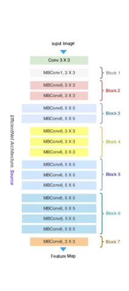
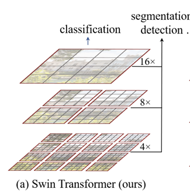
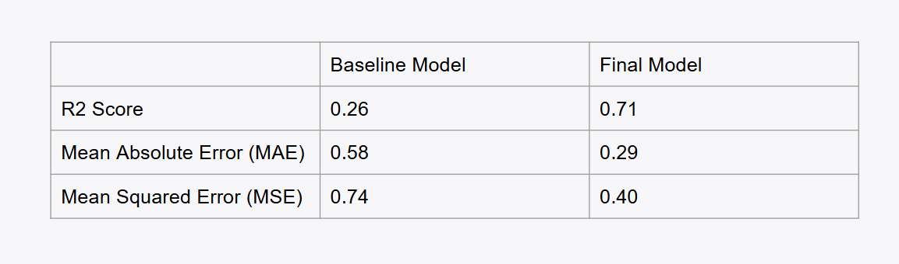

# Plant-trait-prediction
This project aims to predict plant properties - from citizen science plant images and supporting geographical data
Plant traits are crucial for understanding ecosystem dynamics. 
For eg: 
canopy height indicate a plant's competitive ability for sunlight, 
Leaf mass per leaf area highlight adaptations to wind or drought
As conditions evolve, plants may adapt their traits or shift their distributions, leading to significant alterations in ecosystem functioning. 
Our inference tasks involve developing models that can analyze plant photographs to predict various traits accurately.  

## Dataset 
Source of data is Kaggle. The data has been taken from the TRY database (trait information) and the iNaturalist database (citizen science plant photographs). The inputs are images (jpeg) tsv, and  csv files.
The desired outputs are predictions of six different traits - 
Stem specific density (SSD) or wood density (stem dry mass per stem fresh volume) 
Leaf area per leaf dry mass (specific leaf area)
Plant height
Seed dry mass
Leaf nitrogen (N) content per leaf area
Leaf area (in case of compound leaves: leaf, undefined if petiole in- or excluded)

Number of images for training and testing
Train images- 55.5k files
Test images- 7133 files 

Size of the tabular data -

train.csv :- 55489, 176 (78.52mb)

test.csv:- 6545, 164 (8.21mb)

## EDA 
Monthly mean optical reflectance of sunlight for each band

Soil texture components across 0-5 cm depth

## Preprocessing
- Dropped columns having too many null values
- Grouped columns into four types:- WORLD CLIMATE, SOIL, MODIS, VOD
- Removed outliers using IQR method.
- Image Preprocessing- flip, brightness, hue, saturation, crop
- Normalized all the attributes. 

Histogram and Boxplot before Preprocessing 
   

Histogram and Boxplot after Preprocessing 

## Baseline Model Efficient Net B0 with MLP

## Final Model SWIN 
Based on Vision Transformer Architecture
- Image divides into 16x16 patches
- Patches are converted to Path Vectors through Linear Transformation
- Each Path Vectors combine with Positional embeddings

SWIN Architecture
- Image -> 4x4x3 channels -> 48 features -> Linearly transformed
- Divide and Conquer: Attention is introduced but it doesn’t consider all at once,
- It slides and maintains attention for a fixed number of neighbouring sequences
- This output is merged by encoder
- Passed through Linear Projection to decrease dimensionality (e.g. 4c to 2c)
- Steps 1 to 4 happen for multiple runs, where the window is “shifted”

## Results 

